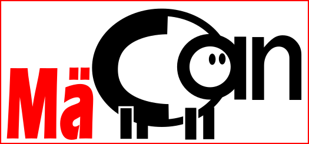

# MäCAN-Project



by [Maximilian Goldschmidt](mailto:maxigoldschmidt@gmail.com)

Hier entsteht ein System zur digitalen Steuerung einer Modellbahn, das auf dem CAN-Bus-Protokoll von Märklin basiert. Ziel ist es, eine preisgünstige und frei zugängliche Lösung zu schaffen.

* [MäCAN-Bibliothek](#mäcan-bibliothek)
* [MäCAN-Weichendecoder (Magnet)](#mäcan-weichendecoder-magnet)

# MäCAN-Bibliothek

Die [MCAN-Bibliothek](MCAN/) dient dazu, eine einfache Möglichkeit zu haben, auf den Märklin CAN-Bus zuzugreifen. Dabei ist es nicht notwendig irgendwelche Berechnungen durchzuführen. Die CAN-Frames werden in nahezu selbsterklärender Weise dageboten


## Dokumentation MCAN-Bibliothek

#### Inhalt

* [Konstanten](#konstanten)
  * [CAN-Befehle](#can-befehle)
  * [Protokolle](#protokolle)
* [Datentypen](#datentypen)
  * [MCANMSG](#mcanmsg)
* [Funktionen](#funktionen)
  * [generateHash(uid)](#generatehashuid)
  * [initMCAN(debug)](#initmcandebug)
  * [sendCanFrame(can_frame)](#sendcanframecan_frame)
  * [getCanFrame()](#getcanframe)

#### Konstanten

Die folgenden Konstanten werden in der Bibliothek definiert und können nach Bedarf im Sketch eingesetzt werden. Das Merken der jeweiligen HEX-Zahlen entfällt damit.

###### CAN-Befehle
````
 SYS_CMD	0x00 	//Systembefehle (abhängig von Unterbefehlen!)
 	 SYS_STOP 	0x00 	//System - Stopp
 	 SYS_GO		0x01	//System - Go
 	 SYS_HALT	0x02	//System - Halt
 SWITCH_ACC 	0x0b	//Magnetartikel Schalten
 S88_EVENT	0x11	//Rückmelde-Event
 PING 		0x18	//CAN-Teilnehmer anpingen
````

###### Protokolle
````
 MM_ACC 		0x3000	//Magnetartikel Motorola
 DCC_ACC 	0x3800	//Magbetartikel NRMA_DCC
 MM_TRACK 	0x0000	//Gleissignal Motorola
 DCC_TRACK 	0xC000	//Gleissignal NRMA_DCC
````

#### Datentypen

###### MCANMSG

Hierbei handelt es sich um einen Struct, der alle relevanten Informationen über einen CAN-Frame, wie er von Märklin dokumentiert ist, beinhaltet.
````
uint8_t cmd      //CAN-Befehl (s.o.)
uint16_t hash    //Berechneter oder festgelegter Hash
bool resp_bit    //gesetztes oder nicht gesetztes Response-Bit
uint8_t dlc      //Anzahl der Daten-Bytes
uint8_t data[8]  //Daten-Bytes
````
Beispiel (Frame für die Antwort auf einen Ping):
````
  can_frame.cmd = PING;
  can_frame.hash = hash;
  can_frame.resp_bit = true;
  can_frame.dlc = 8;
  can_frame.data[0] = UID >> 24;
  can_frame.data[1] = UID >> 16;
  can_frame.data[2] = UID >> 8;
  can_frame.data[3] = UID;
  can_frame.data[4] = 0x00;
  can_frame.data[5] = 0x00;
  can_frame.data[6] = 0x00;
  can_frame.data[7] = 0x00;
````

#### Funktionen

###### generateHash(uid)

Diese funktion kann dazu genutzt, um aus der 32-bit UID der CAN-Komponente gemäß der Dokumentation von Märklin den Hash zu generieren.

Beispiel:
```
#include <MCAN.h>

uint32_t uid = 0x12345678;
uint16_t hash;

MCAN mcan;

void setup() {
  hash = mcan.generateHash(uid);
}
````

Für den Hash ergäbe sich dann 
````
hash = 0x474C
````
Weitere Informationen zum Hash und dessen berechnung sind [Hier](http://medienpdb.maerklin.de/digital22008/files/cs2CAN-Protokoll-2_0.pdf) unter dem Punkt "1.2.4 Hash" zu finden.

###### initMCAN(debug)

Diese Funktion initialisiert den CAN-Controller.
Der Parameter "debug" aktiviert bzw. deaktiviert die Ausgabe von Informationen über die Serielle Schnittstelle des Arduini/µC. Mögliche Werte sind "true" und "false".

Beispiel:
````
#include <MCAN.h>

MCAN mcan;

void setup() {
  mcan.initMCAN(false);
}
````

###### sendCanFrame(can_frame)

Hiermit werden CAN-Frames auf den Bus geschickt. "can_frame" ist vom Typ "MCANMSG", wie [weiter oben](#mcanmsg) beschrieben.

###### getCanFrame()

Empfängt einen CAN-Frame vom Bus. Gibt einen Frame vom Typ "MCANMSG" zurück.

Beispiel:
````
#include <MCAN.h>

MCAN mcan;

MCANMSG can_frame_in;

void setup() {
  pinMode(2, INPUT);
  mcan.initMCAN(false);
}
void loop() {
  if(!digitalRead(2)) can_frame_in = mcan.getCanFrame();
}
````
Alernativ kann hier der Pin 2 (gemäß Arduino-Pinout) als Interrupt benutzt werden.


# MäCAN-Weichendecoder (Magnet)

Der nachfolgende Teil bezieht sich ausschließlich auf die Hardware-Revision A und Software-Version 0.1. Es ist zu beachten, welche Software-Version mit welcher Hardware-Revision kompatibel ist! Alle Hardware-Versionen der gleichen Revision sind zuheinander kompatibel und unterscheiden sich nicht in ihrer Funktionsweise.
